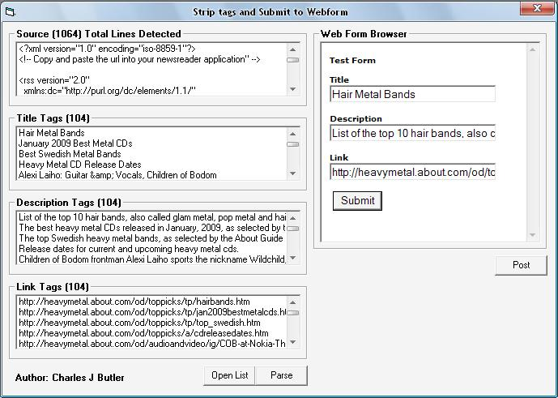



## Automatic Webform Submitter

### Description

Automatically post to your websites form or others. Load your XML, HTML, or Text document and strip out the text between the tags you want, then post everything to your webform. I have included a test xml file along with a test webform for example. You can just change the code to have it point to your webform on the internet. No more manual posting this sets the data and clicks the submit button. I have already posted a few examples relating to this but heres the full program. Please vote and leave comments.
 
### More Info
 
You will need Microsoft Internet Controls loaded (shdocvw or ieframe) and Microsoft Common Dialog Control 6 (comdlg32)

             |
---                |---
**Submitted On**   |2009-02-15 23:00:22
**By**             |[Charles J Butler](https://github.com/Planet-Source-Code/PSCIndex/blob/master/ByAuthor/charles-j-butler.md)
**Level**          |Intermediate
**User Rating**    |5.0 (10 globes from 2 users)
**Compatibility**  |VB 6\.0
**Category**       |[Complete Applications](https://github.com/Planet-Source-Code/PSCIndex/blob/master/ByCategory/complete-applications__1-27.md)
**World**          |[Visual Basic](https://github.com/Planet-Source-Code/PSCIndex/blob/master/ByWorld/visual-basic.md)
**Archive File**   |[Automatic\_2144062152009\.zip](https://github.com/Planet-Source-Code/charles-j-butler-automatic-webform-submitter__1-71777/archive/master.zip)

